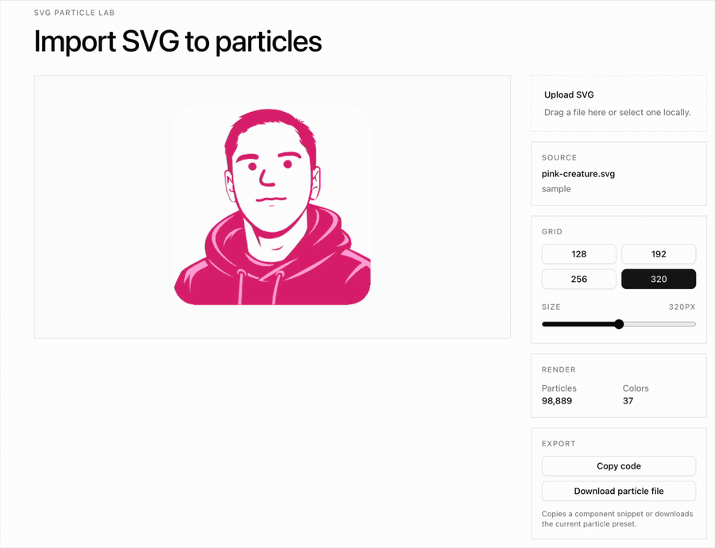

# Turn any SVG into an interactive dithered particle canvas.

`svg-particle-lab` is a React component and demo lab for importing SVG artwork,
rasterizing it in the browser, and rendering it as thousands of interactive 2D
canvas particles. Hover pushes the dots apart. Click fires a shockwave. When the
particles settle, the animation loop stops.

[Try the live demo](https://www.ftchvs.com/en/svg-particle-lab)

## Demo recordings

[](./docs/media/svg-particle-lab-controls-demo.mp4)

[Open controls and export demo](./docs/media/svg-particle-lab-controls-demo.mp4)

## Why this exists

SVGs are easy to ship, but most particle treatments require hand-authored
coordinates, WebGL, or one-off logo code. This package keeps the workflow simple:
bring an SVG, choose a sampling grid, and let the browser turn the vector into a
typed-array particle field.

The technique was inspired by Emil Kowalski's interactive dithered logo work in
[Agents with Taste](https://emilkowal.ski/ui/agents-with-taste). This repo
generalizes the idea into an SVG importer and reusable React renderer. No code
from Emil's article is copied here.

## Install

```bash
npm install svg-particle-lab
```

React is a peer dependency.

```tsx
import { DitheredSvgLogo } from 'svg-particle-lab';

export function LogoParticles() {
  return (
    <DitheredSvgLogo
      svgSrc="/logo.svg"
      grid={256}
      fit="contain"
      size={360}
      aria-label="Logo particle preview"
    />
  );
}
```

## Demo

```bash
npm install
npm run dev
```

The demo includes drag-and-drop SVG import, grid controls, fit controls, size
controls, render stats, JSX snippet copying, and JSON preset export.

## API

### `DitheredSvgLogo`

| Prop | Type | Default | Description |
| --- | --- | --- | --- |
| `svgSrc` | `string` | required | SVG URL. Same-origin paths, object URLs, and CORS-enabled remote URLs work best. |
| `grid` | `number` | `256` | Square rasterization grid. Higher values create more particles and sharper detail. |
| `fit` | `"stretch" \| "contain"` | `"stretch"` | How the SVG is drawn into the square sampling grid. |
| `size` | `number` | `undefined` | CSS pixel width for the square canvas wrapper. |
| `className` | `string` | `undefined` | Class applied to the wrapper element. |
| `style` | `CSSProperties` | `undefined` | Inline styles merged onto the wrapper element. |
| `onStats` | `(stats) => void` | `undefined` | Called after extraction with particle count, color count, and grid size. |
| `aria-label` | `string` | `"Dithered SVG particle canvas"` | Accessible label for the visual. |

```ts
type DitheredSvgStats = {
  dotCount: number;
  colorCount: number;
  grid: number;
};
```

## How it works

1. Load the SVG as an image.
2. Rasterize it into an offscreen square canvas.
3. Sample visible pixels into `(x, y, colorIndex)` triples.
4. Quantize RGB channels into color buckets.
5. Draw all particles in a batched `fillRect` pass, one `fillStyle` per bucket.
6. Apply pointer repulsion and click shockwaves with preallocated typed arrays.
7. Stop `requestAnimationFrame` once the particles settle.

## Performance notes

- Uses `Float32Array`, `Int16Array`, and `Int32Array` for particle state.
- Uses `willReadFrequently: true` for the extraction canvas.
- Buckets particles by quantized color to avoid one `fillStyle` change per dot.
- Filters hover work to mouse pointers; touch still gets click/tap shockwaves.
- Snaps tiny displacements to zero so idle CPU returns to zero after motion.

## Browser and SVG caveats

- This is browser-only. It needs DOM, canvas, pointer events, and image loading.
- SVGs are rasterized by the browser, so browser SVG support applies.
- Remote SVGs can taint the canvas unless served with compatible CORS headers.
  Prefer same-origin assets or object URLs from local uploads.
- Very large or complex SVGs should use a lower `grid` value first.
- The renderer currently targets square canvases.

## Development

```bash
npm install
npm run typecheck
npm run build
npm run lint
```

## License

MIT.
